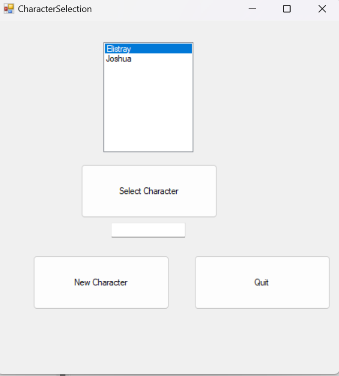
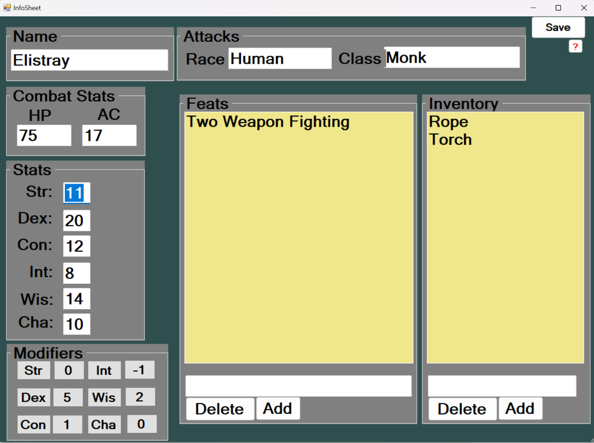

# Heading
This is ~~standard~~ text 

This is a link to [google.com](https://www.google.com/)
# Heading 2 
*This is more standard text* 
I changed this for command line testing
|Table of letters|
|Vowels|Consonants| 
|---|---|
|a|b|
|e|c|
|i|d|
|o|f|
|u|g|
|y|h|

# An example of a project I designed and programmed alongside a partner for my final project from my previous college

## The Character Selection Screen
Seen below is the character selection screen where a use is able to load or create a new character

## The Character Information Screen
This is the bulk of the program, where users are able to input and change the information related to a DND character. The sheet also includes the standard stat modifiers calaculated.  

### Upon adding this example to my demo I had plenty of time to look over what I had done previously and how much I could improve upon it, some important details are missing from the sheet as well as the poorly designed selection screen.